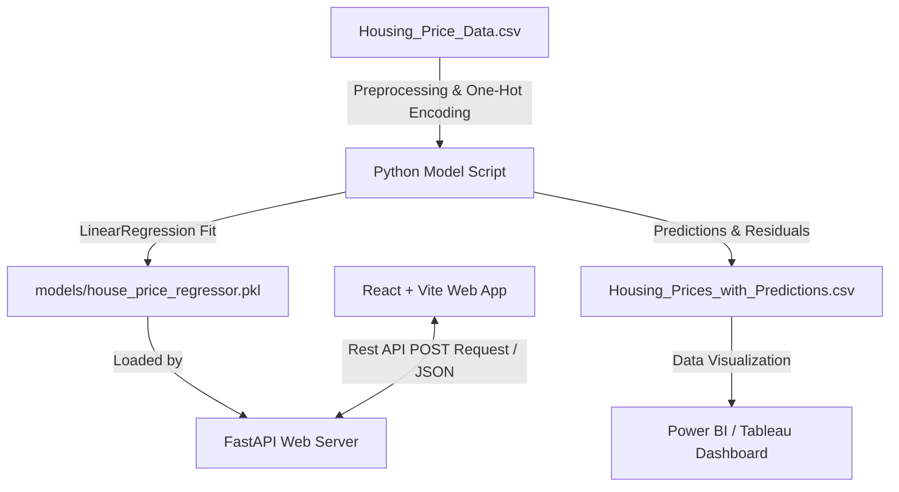

# 🏠 Real Estate Price Prediction System

An end-to-end Machine Learning and Web Application ecosystem that predicts real estate valuation in Sri Lankan Rupees (LKR) based on property architectural features and amenities.

This repository implements a complete pipeline: from raw dataset cleaning, preprocessing, and training a **Linear Regression model**, to serving it via a high-performance **FastAPI backend**, and presenting a premium, interactive **React frontend UI**.

---

## 🏗️ System Architecture & Workflow

The system relies on a seamless data pipeline running from raw CSV analysis to live user interfaces:



---

## 🌟 Key Features

*   **Machine Learning Pipeline:** Preprocesses data automatically, converting text labels (`yes`/`no`) to binary values and performing one-hot encoding for multi-class variables (furnishing status).
*   **Production API Service:** A lightweight FastAPI server exposes a rapid `/predict` endpoint, complete with robust schema verification using Pydantic.
*   **Modern Interactive Frontend:** A beautifully designed, fully responsive React form engineered with dark mode styling, custom range controls, toggles, and state loaders.
*   **BI & Analytics Ready:** Generates an enriched dataset incorporating actual prices, model predictions, and residuals, allowing immediate analytics in reporting tools like Power BI.

---

## 📂 Project Repository Layout

```text
House_Price_Prediction_System/
├── data/
│   ├── Housing_Price_Data.csv              # Raw housing features and prices dataset
│   └── Housing_Prices_with_Predictions.csv # Preprocessed dataset with predictions & residuals
├── models/
│   └── house_price_regressor.pkl          # Serialized production-ready model binary
├── src/
│   ├── app.py                             # FastAPI prediction application layer
│   └── house_price_model.py               # Model preprocessing, training, and evaluation script
├── frontend/
│   ├── src/
│   │   ├── App.jsx                        # React interface and valuation engine layout
│   │   ├── App.css                        # CSS rules for responsive visuals
│   │   ├── main.jsx                       # React app renderer entrypoint
│   │   └── index.css                      # Global design system definitions
│   ├── index.html                         # Document framework
│   ├── package.json                       # JavaScript package configurations
│   └── vite.config.js                     # Vite build utility settings
├── requirements.txt                       # Python environment dependencies
└── README.md                              # Main system overview and setup guide
```

---

## 🛠️ Technical Implementation Details

### 1. Preprocessing & Model Training (`src/house_price_model.py`)
*   **Feature Mapping:** Maps binary features (`mainroad`, `guestroom`, `basement`, `hotwaterheating`, `airconditioning`, `prefarea`) from `'yes'`/`'no'` string labels into integer flags (`1`/`0`).
*   **One-Hot Encoding:** Encodes the categorical `furnishingstatus` into two distinct features (`semi-furnished`, `unfurnished`), avoiding the dummy variable trap.
*   **Model Selection:** Scikit-Learn `LinearRegression` computes the line of best fit over 12 property dimensions.
*   **Analytics Export:** Computes absolute predictions and prediction error metrics per row, exporting them into a dedicated CSV structure for downstream business analysis.

### 2. Live API Service Layer (`src/app.py`)
*   **FastAPI Engine:** Standardizes input feature expectations using a Pydantic `HouseFeatures` model structure.
*   **Dynamic Loader:** Resolves relative script directories to load `house_price_regressor.pkl` dynamically.
*   **Cors Policy:** Standardizes origin policies allowing external connections from the React client.

### 3. Client Frontend (`frontend/src/App.jsx`)
*   **Reactive State Handling:** Updates input hooks dynamically as user toggles features.
*   **User Action Feedback:** Provides load badges and error fallbacks when communicating with backend services.
*   **Currency Representation:** Dynamically scales values, displaying final valuations cleanly as `LKR X.XXM` (Millions of Sri Lankan Rupees).

---

## 🚀 Setup & Execution Guide

### Prerequisite Checklist
*   Python 3.8+ installed.
*   Node.js (LTS version recommended) and npm installed.

---

### Step A: Model Training & Backend Setup

1.  **Clone or Open the Repository:**
    ```bash
    cd House_Price_Prediction_System
    ```

2.  **Create & Activate a Python Virtual Environment:**
    ```bash
    python -m venv .venv
    # Windows:
    .venv\Scripts\activate
    # macOS/Linux:
    source .venv/bin/activate
    ```

3.  **Install Python Dependencies:**
    ```bash
    pip install -r requirements.txt
    ```

4.  **Train the Machine Learning Model:**
    Run the model pipeline to analyze raw data, calculate baseline scores, and generate your prediction model binary (`house_price_regressor.pkl`):
    ```bash
    python src/house_price_model.py
    ```
    *Output will display the model's metrics:*
    ```text
    Model Training Complete! R² Score: 0.68
    Mean Absolute Error: LKR 970,043.40
    Housing_Prices_with_Predictions.csv has been successfully generated!
    Production model successfully saved to: ...\models\house_price_regressor.pkl
    ```

5.  **Launch the FastAPI Server:**
    ```bash
    python src/app.py
    ```
    The prediction engine is now active and listening at `http://127.0.0.1:8000`. You can inspect the interactive OpenAPI swagger docs at `http://127.0.0.1:8000/docs`.

---

### Step B: Frontend Installation & Launch

1.  **Navigate into the Frontend Directory:**
    ```bash
    cd frontend
    ```

2.  **Install Node Modules:**
    ```bash
    npm install
    ```

3.  **Launch the React + Vite UI Dev Server:**
    ```bash
    npm run dev
    ```
    Open the server location provided in the console (usually `http://localhost:5173`) in your browser to start predicting.

---

## 📊 Business Intelligence (BI) Dashboard Integration

The training script automatically generates a highly specialized data export at `data/Housing_Prices_with_Predictions.csv`. 

This table contains:
*   All original property descriptors.
*   The exact actual transaction values (`price`).
*   The model's predictions (`predicted_price`).
*   Calculated model residuals (`prediction_error`).

By loading this CSV directly into tools like **Power BI** or **Tableau**, developers and business analysts can build insightful dashboards showing:
1.  **Actual vs. Predicted Price comparison** (Scatterplots highlighting model precision).
2.  **Error Distribution metrics** (Evaluating which property features cause high pricing deviation).
3.  **Amenity Price Premiums** (Evaluating the ROI of installing Air Conditioning or adding off-street Parking).

---

## 📡 Backend API Endpoints

### **POST /predict**
Submit property parameters to obtain a real-time valuation estimate.

*   **Request Schema (JSON):**
    ```json
    {
      "area": 5500.0,
      "bedrooms": 3,
      "bathrooms": 2,
      "stories": 2,
      "mainroad": 1,
      "guestroom": 0,
      "basement": 1,
      "hotwaterheating": 0,
      "airconditioning": 1,
      "parking": 2,
      "prefarea": 1,
      "furnishingstatus_semi_furnished": 1,
      "furnishingstatus_unfurnished": 0
    }
    ```

*   **Response Schema (JSON):**
    ```json
    {
      "estimated_price": 7824103.54,
      "currency": "LKR"
    }
    ```

---

## 📝 License
This project is open-source and available under the MIT License.
